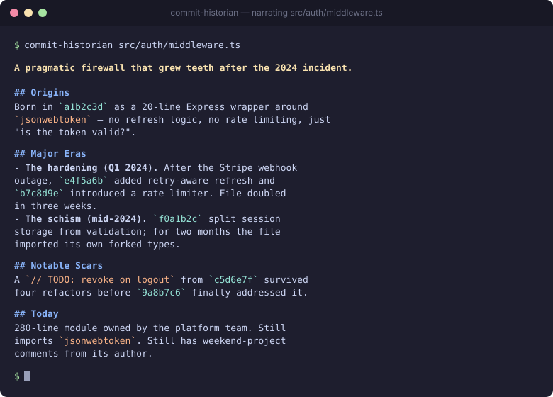

# commit-historian

> Point it at any file in your git repo. Get a short, vivid narrative of how it came to be.

<p align="center">
  
</p>

`commit-historian` is a CLI code archaeologist. It feeds a file's `git log` (with patches) to Claude and asks for a story — with real commit SHAs as anchors — so you can read the *why* behind code, not just the *what*.

<sub>The image above is an illustrative example. Drop in a real capture from your repo after running it.</sub>

```bash
$ commit-historian src/auth/middleware.ts

**A pragmatic firewall that grew teeth after the 2024 incident.**

## Origins
Born in `a1b2c3d` as a 20-line Express wrapper around `jsonwebtoken` — no
refresh logic, no rate limiting, just "is the token valid?". Author: one
person, one weekend.

## Major Eras
- **The hardening (Q1 2024).** After the Stripe webhook outage, `e4f5a6b`
  added retry-aware token refresh and `b7c8d9e` introduced a rate limiter.
  The file doubled in size in three weeks.
- **The schism (mid-2024).** `f0a1b2c` split session storage from
  validation; for two months the file imported its own forked types
  before `d3e4f5a` cleaned them up.

## Notable Scars
A dormant `// TODO: revoke on logout` from `c5d6e7f` survived four
refactors before finally being addressed in `9a8b7c6`.

## Today
A 280-line module owned by the platform team. Still imports
`jsonwebtoken`. Still has one weekend's worth of comments from its
original author.
```

## Install

```bash
npx commit-historian <path>
# or globally
npm i -g commit-historian
```

## Usage

```bash
commit-historian <path>                  # full history with patches
commit-historian <path> --short          # metadata only, faster + cheaper
commit-historian <path> --since v1.0     # limit to a ref or date
commit-historian <path> --model <id>     # override model
commit-historian <path> --dry-run        # print the prompt; no API call
```

Requires `ANTHROPIC_API_KEY` in your environment. Defaults to
`claude-sonnet-4-6`.

## Why

`git log` answers *what changed*. `git blame` answers *who*. Neither
answers *why this file is shaped the way it is* — which is the actual
question when you join a project, audit a module, or onboard onto a
team's code. `commit-historian` does that, with citations.

## How it works

1. Resolves the file inside your repo (follows renames).
2. Runs `git log --follow -p --date=short` and caps the patch payload.
3. Streams the log to Claude with a strict system prompt: anchor every
   claim to a real short SHA, surface tensions and reverts, keep it
   under ~450 words.
4. Streams the markdown narrative to stdout.

No data leaves your machine except the git log you pass to Anthropic's
API.

## License

MIT
